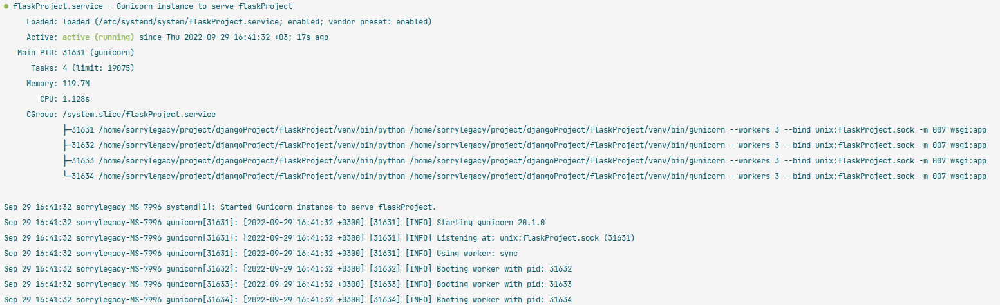

1 - Flask
===============
Для работы с проектом склонируйте его себе с помощью: 
<code>git clone https://github.com/SorryLegacy/qwer18.git</code>

После этого зайдите в виртуальное окружение и установить все зависимости с помощью: 
<code>pip3 install -r requirements.txt</code>
После этого настройте ваше подключение к бд.
Создайте файл <strong>.env</storng> с переменными:
<ul>
<li>
USER_DATABASE
</li>
<li>
USER_PASSWORD
</li>
<li>
NAME_DATABASE
</li>
</ul>
И запустите приложение с помощью:
<code>flask run</code>

2 - Настройка Gunicorn  
===============
Сначала стоит проверить сможет ли наше приложение работать с Gunicorn. 
Для этого нужно только передать <strong>wsgi:app</strong> для точки входа  
<code>
(venv)sorrylegacy@sorrylegacy-MS-7996:~/project/djangoProject/flaskProject$ gunicorn --bind 0.0.0.0:5000 wsgi:app </code>

<h3>Результат примерно выглядеть так</h3>
<code>
[2022-09-29 15:31:31 +0300] [27994] [INFO] Starting gunicorn 20.1.0  
[2022-09-29 15:31:31 +0300] [27994] [INFO] Listening at: http://0.0.0.0:5000 (27994)  
[2022-09-29 15:31:31 +0300] [27994] [INFO] Using worker: sync  
[2022-09-29 15:31:31 +0300] [27995] [INFO] Booting worker with pid: 27995
 </code>

<h3>Откройте браузер и пройдите по адресу серверного ip с 5000 портом: </h3>

<code>http://server_ip:5000</code>

И вы увидите результат приложения. 

После того как вы убедитесь в нормальной работе приложения, можно остановить приложение нажав  <strong>CTRL+C</strong>.

Далее создадим файл для служебных элементов. 
<code>sudo nano /etc/systemd/system/ <strong>yourproject</strong>.service</code>

Этот файл нам нужен для чтобы Ubuntu автоматически запускать Gunicorn и работать с Flask при загрузке сервера 
Внутри файла нужно прописать данную конфигурацию:

<code>
[Unit] 
Description=Gunicorn instance to serve flaskProject 
After=network.target  
[Service] 
User=<strong>yourname</strong> 
Group=www-data 
WorkingDirectory=/home/<strong>yourname</strong>/<strong>yourproject</strong> 
Environment="PATH=/home/<strong>yourname</strong>/<strong>yourproject</strong>/<strong>yourenv</strong>/bin" 
ExecStart=/home/<strong>yourname</strong>/<strong>yourproject</strong>/<strong>yourenv</strong>/bin/gunicorn --workers 5 --bind unix:yourproject.sock -m 007 wsgi:app 
[Install] 
WantedBy=multi-user.target 
</code>

Шаблон сервиса хранится в файле <strong>gunicorn.service </strong>

Далее сохраните и закройте файл и в вашем терминале напишет данные команды: 
<code>sudo systemctl start <strong>yourproject</strong></code> 
<code>sudo systemctl enable  <strong>yourproject</strong></code>

После этих команд проверим состояние. Сделать это можно с помощью команды: 
<code>sudo systemctl status <strong>yourproject</strong></code> 
Ответ должен выглядеть примерно следующим образом: 

3 - Настройка Nginx
===============
Для начала работы с <strong>Nginx</strong> стоит проверить есть ли он у вас. Для этого в терминале напишите 
<code> nginx -v </code> 
Если вам показал версию, то он установлен 
<code>nginx version: nginx/1.18.0 (Ubuntu)</code> 
Для начала нам нужно создать файл конфигурации: 
<code>sudo nano /etc/nginx/sites-available/<strong>yourproject</strong></code>
Код в нем должен выглядеть таким образом: 

<code>
server { 
   listen 80; 
   server_name <strong>yourdomain</strong>;  
   location / { 
        include proxy_params; 
        proxy_pass http://unix:/home/<strong>yourname</strong>/<strong>yourproject</strong>/<strong>yourproject.sock</strong>; 
    } 
} 
</code>

Сохраните и закройте файл. Осталось активировать данную конфигурацию.
Для этого стоит прописать в терминал: 
<code>sudo ln -s /etc/nginx/sites-available/<strong>yourproject</strong> /etc/nginx/sites-enabled</code>
После этого перегрузите Nginx с помощью команды:
<code>sudo systemctl restart nginx </code> 
После этих манипуляций у вас должна была появиться возможность увидеть приложение в браузере